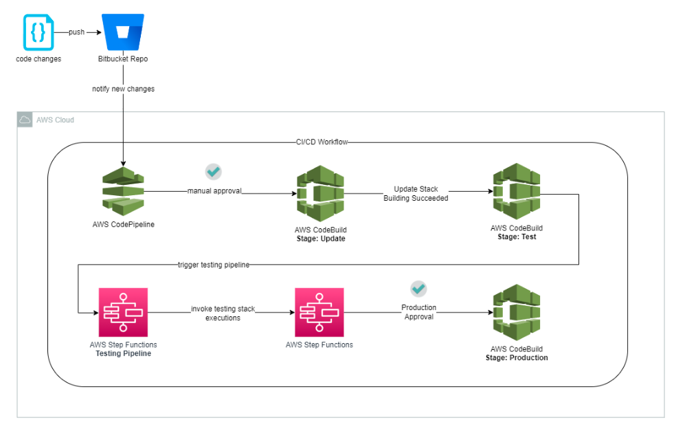

# AWS_CodePipeline-CICD #

## Overview ##

This is a severless CICD application created from AWS SAM template (AWS Cloud Formation), this project will consist of AWS serverless services and development codes that are used in the serverless app CICD pipeline, for instances : CodePipeline, CodeBuild project, CodeStar connection etc.


---
## Table of Contents ##

- [Prerequisites](#prerequisites)
- [Building](#build)
- [Deploying](#deploy)
- [Elaboration](#elaboration)
- [Usage](#usage)
- [Author](#author)

---
## Prerequisites <a name = "prerequisites"></a> ##

* Install AWS CLI : [installation guide](https://docs.aws.amazon.com/cli/latest/userguide/getting-started-install.html)
* AWS CLI : [installation guide](https://docs.aws.amazon.com/cli/latest/userguide/getting-started-install.html)
* AWS Account Credentials : [How to guide](https://docs.aws.amazon.com/cli/latest/userguide/cli-configure-envvars.html)
* AWS CodeStar Connection : [How to guide](https://docs.aws.amazon.com/dtconsole/latest/userguide/connections-create-bitbucket.html)
---
## Building <a name = "build"></a> ##

* Build the sam application.

```bash
$ sam build
```

---
## Deploying <a name = "deploy"></a> ##

1. When you see **Build Succeeded** from the last step, deploy the sam application to AWS cloud.

```bash
$ sam deploy
```
```bash
Deploy this changeset? [y/N]: y
```
2. As long as all resources are created, you will see the following output.

```bash
Successfully created/updated stack
```

---
## Elaboration <a name = "elaboration"></a> ##

**[Source Stage]**
1. The CICD pipeline will be automatically triggered if any code pushes occur in the target bitbucket repository.
2. Next, the Source stage passes the source code to the Update stage to test whether it can be deployed successfully in the update stack.

**[Update Stage]**
1. Whenever the Update stage receives a new code push from the Source stage, it sends a notification via SNS and waits for manual approval to proceed.
2. After receiving approval from the user, the Update stage begins building and deploying the source code to an update enviornment.

**[Test Stage]**
1. Following the successful deployment in the Update stage, the Test stage builds and deploys a test enviornment with the source code.
2. Next, the Test stage invokes the test statemachine for testing the updated enviornment built from the source code.

**[Production Stage]**
1. After successfully proceeded all of the above tasks and tests, the Production stage sends a notification via SNS and waits for manual approval to deploy.
2. After receiving approval from the user, the Production stage begins building and deploying the source code to the Production enviornment.

---
## Usage <a name = "elaboration"></a> ##
Make sure the **buildSpec.yml** and **samconfig.toml** files have been correctly placed in the target source code repository (serverless-app repo).
```bash
/serverless-app
  buildspec.yml
  samconfig-test.toml
  samconfig-update.toml
  samconfig-prod.toml
  template.yml
```
#### buildspec.yml
The **buildspec.yml** file specifies respective building commands in different building enviornment to build the CICD pipeline.
```
version: 0.2
phases:
  build:
    commands:
    - |
      echo "Building with BUILD_STAGE = $BUILD_STAGE"
      case "$BUILD_STAGE" in
      UPDATE)
        sam build
        sam deploy --config-file samconfig-update.toml --no-confirm-changeset
        ;;
      TEST)
        sam build
        sam deploy --config-file samconfig-test.toml --no-confirm-changeset
        ;;
      PROD)
        sam build
        sam deploy --config-file samconfig-prod.toml --no-confirm-changeset
        ;;
      *)
        echo "Unknown build stage: $BUILD_STAGE"
        exit 1
        ;;
      esac
```
#### samconfig-[update/test/prod].toml (IN TARGET REPO)
Ensure the ```stack_name``` in **samconfig-update.toml**, **samconfig-test.toml**, **samconfig-prod.toml** are updated based on different building enviornments. 
```toml
version = 0.1
[default]
[default.deploy]
[default.deploy.parameters]
stack_name = "app-[update/test/prod]"
s3_bucket = "aws-sam-cli-managed-default-samclisourcebucket-5393oi3qf7t8"
s3_prefix = "app-[update/test/prod]"
region = "us-east-1"
confirm_changeset = true
capabilities = "CAPABILITY_IAM"
disable_rollback = false
parameter_overrides = "ProjectName=\"app\" Stage=\"[update/test/prod]\""
image_repositories = []
```
You can now trigger CI/CD pipeline by **pushing new changes** to the target repository. The pipeline will automatically start and pause at the first approval stage.

---
## Who do I talk to <a name = "author"></a> ##

* Jeffrey Wang (jeffrey.wanggg@gmail.com)
